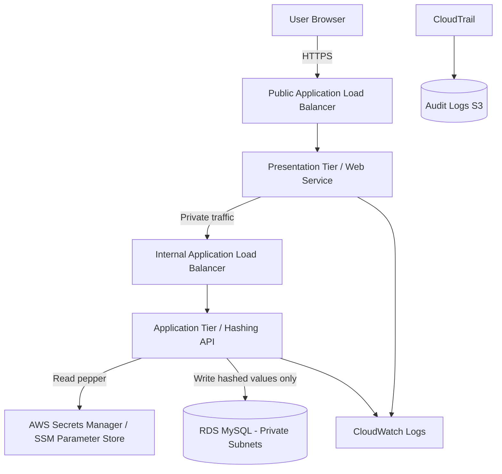

# AWS Secure 3-Tier User Data Capture Platform

A recruiter-ready AWS cloud engineering project showing how to design and deploy a secure 3-tier web application that captures user information and stores sensitive fields as **one-way hash values** rather than clear text.

This project is written for a candidate moving from hands-on infrastructure, networks, and banking environments into cloud architecture and DevSecOps. It demonstrates AWS networking, segmentation, infrastructure as code, CI/CD, database hardening, secrets handling, and application-level data protection.

## Executive Summary

The solution deploys a secure 3-tier architecture on AWS:

1. **Presentation tier**: Public Application Load Balancer and web entry point.
2. **Application tier**: Private application service where sensitive data is validated and hashed before persistence.
3. **Data tier**: Amazon RDS MySQL in isolated private database subnets with encryption at rest.

Sensitive fields such as passwords, national ID numbers, or phone numbers are never stored in clear text. The application derives salted hashes using PBKDF2-HMAC-SHA256 before writing to the database. A separate application pepper is retrieved from AWS Secrets Manager / SSM Parameter Store so that a database-only compromise does not expose the original values.

> Note: Hashing is one-way. It is suitable for passwords and verification-only sensitive fields. If a field must later be displayed back to the user, use encryption or tokenisation instead of hashing.

## Architecture Goals

- Build a cloud equivalent of a traditional on-prem 3-tier application.
- Separate public, private application, and database networks.
- Prevent direct internet access to the database.
- Store only hashed sensitive values in the database.
- Encrypt RDS storage using AWS KMS.
- Automate infrastructure deployment using Terraform.
- Automate validation, plan, and deployment using GitHub Actions.
- Demonstrate security controls expected in regulated banking-style environments.

## High-Level Architecture



## Security Controls Demonstrated

| Control Area | Implementation |
|---|---|
| Network segmentation | Public, private app, and private data subnets across two Availability Zones |
| Database isolation | RDS is deployed in private DB subnets only, no public accessibility |
| Least privilege | Separate IAM roles for CI/CD and application runtime |
| Data protection | PBKDF2-HMAC-SHA256 salted hashing before database insert |
| Pepper protection | Application pepper stored outside the database in Secrets Manager / SSM |
| Encryption at rest | RDS encrypted with KMS |
| Secrets handling | Terraform and GitHub Actions use GitHub Secrets / OIDC; no secrets committed |
| Auditing | CloudTrail and CloudWatch log groups included |
| CI/CD | GitHub Actions validates, formats, plans, and applies Terraform |

## Repository Structure

```text
aws-secure-3tier-hashed-data/
├── README.md
├── app/
│   ├── app.py
│   ├── requirements.txt
│   └── Dockerfile
├── terraform/
│   ├── main.tf
│   ├── variables.tf
│   ├── outputs.tf
│   ├── versions.tf
│   └── terraform.tfvars.example
├── .github/
│   └── workflows/
│       └── terraform.yml
├── docs/
│   ├── architecture.md
│   ├── security-design.md
│   ├── recruiter-summary.md
│   └── testing-guide.md
└── diagrams/
    └── architecture.mmd
```

## Deployment Overview

### 1. Create AWS deployment role

For a professional project, use GitHub Actions OIDC rather than long-lived access keys. Create an IAM role trusted by your GitHub repository and give it permissions needed for Terraform deployment.

Required GitHub repository variables/secrets:

| Name | Type | Purpose |
|---|---|---|
| `AWS_REGION` | Repository variable | Target AWS region |
| `AWS_ROLE_TO_ASSUME` | Repository secret | IAM role ARN for GitHub OIDC |
| `TF_VAR_db_username` | Repository secret | RDS admin username |
| `TF_VAR_db_password` | Repository secret | RDS admin password |
| `TF_VAR_app_pepper` | Repository secret | Application pepper used in hashing |

### 2. Run Terraform locally for first validation

```bash
cd terraform
terraform init
terraform fmt
terraform validate
terraform plan \
  -var='db_username=adminuser' \
  -var='db_password=ChangeMeStrongPassword123!' \
  -var='app_pepper=replace-with-random-32-byte-secret'
```

### 3. Push to GitHub

```bash
git init
git add .
git commit -m "Initial secure AWS 3-tier hashed data platform"
git branch -M main
git remote add origin https://github.com/<your-username>/aws-secure-3tier-hashed-data.git
git push -u origin main
```

## Application Behaviour

The sample API accepts user details and hashes sensitive values before database storage.

Example input:

```json
{
  "first_name": "Jane",
  "last_name": "Doe",
  "email": "jane@example.com",
  "password": "SuperSecretPassword!",
  "national_id": "AB123456C",
  "phone_number": "+441234567890"
}
```

Example database record:

```text
first_name: Jane
last_name: Doe
email: jane@example.com
password_hash: pbkdf2_sha256$150000$...
national_id_hash: pbkdf2_sha256$150000$...
phone_number_hash: pbkdf2_sha256$150000$...
```

## Recruiter Talking Points

- Designed AWS 3-tier architecture aligned to enterprise infrastructure patterns.
- Applied banking-grade security thinking: segmentation, audit logging, encryption, least privilege, and secret isolation.
- Used Terraform to codify repeatable infrastructure.
- Used GitHub Actions to automate validation and deployment.
- Demonstrated practical understanding that encryption and hashing solve different problems.
- Shows transition from on-prem network/infrastructure support into AWS cloud engineering and DevSecOps.

## Suggested GitHub Repository Name

`aws-secure-3tier-hashed-data-platform`

## Suggested GitHub Description

`AWS 3-tier secure data capture platform using Terraform, GitHub Actions, RDS encryption, private subnets, and application-level hashing to protect sensitive user data.`

## Cost Warning

This project can create chargeable AWS resources such as NAT Gateway, Application Load Balancers, RDS, KMS, and CloudWatch logs. Destroy lab resources when not in use:

```bash
terraform destroy
```

## Future Improvements

- Add AWS WAF in front of the public ALB.
- Add ACM certificate and enforce HTTPS only.
- Add RDS read replica and automated backup retention policy.
- Move the application to ECS Fargate or EKS for container orchestration.
- Add SAST, dependency scanning, Checkov, tfsec, or Trivy to the pipeline.
- Add AWS Config rules and Security Hub for continuous compliance.
