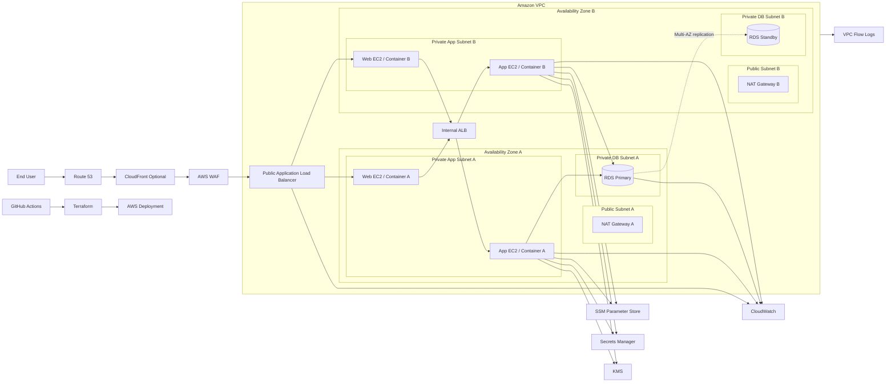

# AWS Architecture Design

## AWS service mapping

| Layer | AWS Service | Purpose |
|---|---|---|
| DNS | Route 53 | Public DNS resolution |
| Edge security | AWS WAF | Protect public ALB from common web attacks |
| Public ingress | Application Load Balancer | Terminate public web traffic |
| Networking | VPC, subnets, route tables | Network isolation and segmentation |
| Outbound access | NAT Gateway per AZ | Private subnet outbound internet access |
| Compute | EC2 Auto Scaling Groups | Web and application services |
| Internal routing | Internal Application Load Balancer | Route web tier traffic to application tier |
| Database | Amazon RDS MySQL Multi-AZ | Managed relational database with failover |
| Encryption | AWS KMS | Encryption keys for RDS and parameters |
| Secrets | Secrets Manager / SSM Parameter Store | Store DB credentials and hashing pepper/salt material |
| Audit | CloudTrail | AWS API audit trail |
| Monitoring | CloudWatch | Logs, metrics, alarms |
| Network visibility | VPC Flow Logs | Network traffic visibility |
| Automation | Terraform | Infrastructure as Code |
| CI/CD | GitHub Actions | Automated validation, plan, and deployment |

## AWS architecture diagram

## Network controls

- Public subnets host only load balancers and NAT gateways.
- Web and application workloads run in private subnets.
- RDS is deployed only in private database subnets.
- Security groups restrict traffic by source security group, not broad CIDR ranges.
- Database ingress is limited to the application tier security group.

## Failover behaviour

- If one web instance fails, the ALB routes traffic to healthy targets.
- If one application instance fails, the internal ALB routes traffic to healthy application targets.
- If one AZ fails, traffic continues through resources in the second AZ where available.
- If the RDS primary fails, RDS Multi-AZ promotes the standby instance automatically.

## Terraform and GitHub Actions design

Terraform defines all AWS resources in code. GitHub Actions provides automated checks and deployment control:

1. `terraform fmt -check`
2. `terraform validate`
3. `terraform plan` on pull request
4. manual review of the plan
5. `terraform apply` on merge to main

For production use, GitHub should authenticate to AWS using OpenID Connect rather than long-lived access keys.

## Breach-aware data protection objective

This design was created in response to the growing impact of large-company data breaches. The architecture assumes that attackers may attempt to harvest passwords, contact details, National Insurance numbers, account identifiers, and biometric-derived verification data. The system therefore minimises database exposure by storing verification-only sensitive values as hashes, isolating secrets outside the database, and combining application-level protection with AWS network segmentation and encryption controls.
